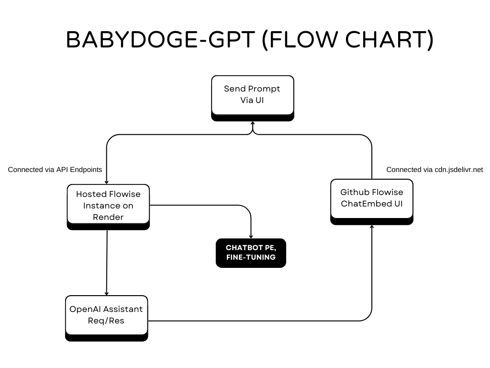
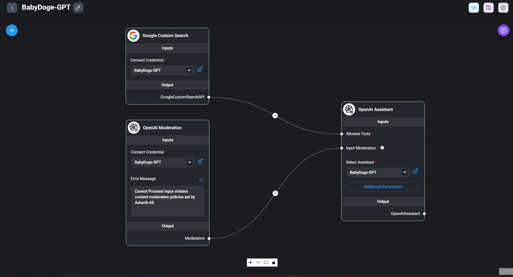

# BabyDoge-GPT - Smart AI Assistant for BabyDoge Community 🤖

(This project is a submission to the BNB Chain Hackathon💎)

 

✨ BabyDogeGPT 🔥

 

## Project Overview

**BabyDoge-GPT** is an intelligent, meme-centric AI chatbot designed to provide comprehensive insights into the BabyDoge Coin project while maintaining a fun, engaging tone. Developed as a submission for the "BNB Chain Hackathon 2024 Q2: OneBNB - Coding the Future" competition under the "BabyDoge Project" challenge, this assistant specializes in delivering accurate BabyDoge Coin information and curating playful memes in the unmistakable Doge style. It aims to help community members better understand and promote BabyDoge Coin in a way that generates enthusiasm and hype across social media.

## Problem Statement

The BabyDoge community often struggles to create appropriate meme-like text content that fits the Baby Doge theme for crypto-related topics and events, and there's no central point to engage and understand the project in a unique and simple way. 

To address this, we offer three key services:
1. We help the community create engaging and humorous memes about BabyDoge Coin. This support is vital for a meme-centric project, as both textual and visual memes are essential for promoting BabyDoge Coin on social media, generating excitement, and encouraging coin purchases, which benefit the entire community. Provide the prompt, and we'll handle the rest.
2. We provide a comprehensive knowledge base about BabyDoge Coin, enabling newcomers and meme enthusiasts to learn about the project and its features through a conversational user interface (CUI). 
3. Live on-chain data about the project, like current price, market cap, etc.

## Benefits and Features

- **Comprehensive Knowledge Base**: Offers accurate, relevant information about BabyDoge Coin to cater to beginners, enthusiasts, and the wider crypto community.
- **Meme Creation**: Randomly generates BabyDoge-themed memes on demand, helping the community engage and promote BabyDoge Coin effectively.
- **Fun, Engaging Style**: Responds to questions in a lighthearted Doge-inspired manner while maintaining accuracy and professionalism.
- **Blockchain Integration**: Explore blockchain analytics directly to showcase BabyDoge's on-chain metrics, real-time data about the $babydoge coin.
- **Alignment with Hackathon Challenge**: Directly aligns with the "BabyDoge Project" challenge by using creative means to drive interest in BabyDoge Coin.

## Features

🎯 Personalized answers for community.  
🕒 Real-time updates from Internet.  
👨‍💻 Chat via CUI (Conversational User Interface).  
🎤 Voice functionality for easy interaction.  
👍 Provide Feedback.  
☑️12 Limit Messages per 24 hours.  

## Benefits

🌟 Enhances user experience.  
📰 Keeps the BabyDoge community informed.  
🌐 Makes BabyDoge more accessible.  
📈 Fosters greater engagement and project development.  

## Usage

- **Chat Interface:** Access the chatbot via the web UI and ask any BabyDoge-related questions. You can also request a meme to share on social media.
- **Speech Input:** Enable voice recognition to interact with BabyDoge-GPT using natural speech.
- **Custom Memes:** Experiment with different meme prompts and see the assistant generate random BabyDoge memes.

## Tech Stack

- **OpenAI Assistant APIs**: Powers the natural language processing abilities to deliver accurate responses and maintain a conversational style with (function calling, code interpreter, and file search).
- **FlowiseAI**: Enables visual programming to streamline the development of conversational AI workflows.
- **Next.js, TypeScript, TailwindCSS**: Provides a seamless, dynamic user interface with a consistent design.
- **OpenAI GPT-4o and Moderation APIs**: Handles advanced chatbot responses and content moderation.
- **Google Custom Search API**: Allows the chatbot to fetch relevant information online to provide up-to-date answers.
- **Custom Training Data with Prompt Engineering**: Ensures precise responses through well-crafted prompts and curated data.
- **OpenAI Whisper API for Speech-to-Text**: Supports speech recognition to deliver a multi-modal experience.
- **LangSmith API for Chatbot Analysis**: Analyzes chatbot interactions for optimization and refinement.

**=> How Everything is Connected? (FlowChart)**

- [Flowise Github Repositry](https://github.com/AsharibAli/flowise) (Deployed on Render & Connected to Chatbot UI via APIs programmatically).
- [FlowiseChatEmbed Github Repositry](https://github.com/AsharibAli/FlowiseChatEmbed) (UI/UX of Chatbot, Connected via CDN)

**=> (Behind the Scene) Flowise Flow Of BabyDoge-GPT**

## Potential Integration

I have build two version of the BabyDoge-GPT, both have the same functionalites but one chatbot fix in the full viewport of the screen and another one is the pop-up version, both have same instances and build with APIs, these chatbot's can-be integrated into anywhere either on the complete subdomain of official baby-doge website or the website but with the popup version, but I don't know what the team thinks about it.

- **[BabyDoge-GPT Full Version CodeBase](./BabyDogeGPT-Full%20version/)**
- **[BabyDoge-GPT Popup Version CodeBase](./BabyDogeGPT-Popup%20version/)**

### Live Hosted demo of BabyDoge-GPT

➡️ [Full Version](https://babydogegpt.vercel.app/)  
➡️ [Popup Version](https://babydogegpt-popup.vercel.app/)

## Future Improvements

- **Expanded Knowledge Base**: Integrate with additional BabyDoge resources to provide more comprehensive insights.
- **Community Analytics:** Access real-time community sentiment about the project through metrics from X and other social platforms.
- **On-Chain AI Swap:** Swap your BabyDoge tokens directly using a simple prompt.
